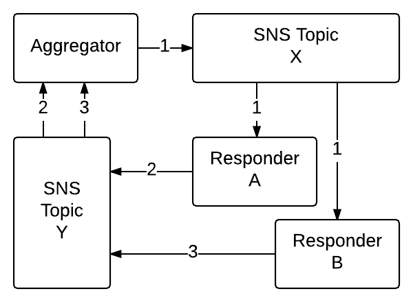

# aws-scatter-gather

An NPM package that facilitates the scatter gather design pattern using AWS SNS Topics.

## About

A scatter-gather design pattern sends a single request to many servers and then aggregates the responses of those servers. Because this module uses AWS SNS Topics for communication it is using an asynchronous messaging pattern.

### What is an SNS Topic

An AWS SNS Topic is a messaging channel that any number of servers can subscribe to. When the SNS Topic receives an event it pushes that event to all servers that are subscribed to the topic.

### Synchronous vs Asynchronous Messaging

HTTP is commonly used to make synchronous requests:

1. A client initiates a connection with a server.
2. The client sends the request over that connection.
3. The server sends the response over that connection.
4. The connection is closed.

For asynchronous requests:

1. A client initiates a connection with a server.
2. The client sends the request over that connection.
3. The server confirms that the request was received.
4. The connection is closed.
5. At some point in the future:
    1. The server initiates a connection with the client*.
    2. The server sends the response to the client.
    3. The client confirms the response was received.
    4. The connection is closed.

\* *I am aware that the server is now the client and the client the server, but to keep things simple I kept their names the same.*


### Deciding on the Number of Topics

**Option 1**

The below image more accurately portrays messaging when using a single SNS Topic:


Using a single topic reduces initial set up, but it increases network traffic and the number of times requests are processed. The number of additional requests that would be made in this situation can be caluculated using this formula:

`N x N + 1`

`N` is the number of servers responding to the request.

So, if you have `5` servers that are responding to requests from the aggregator then you'll have a total of 26 additional requests that did not need to be made. Every requests will consume both consume the network bandwidth and processing time.

**Option 2**

An alternative is to use two SNS Topics:

1. Topic X can be subscribed to by all servers that are listing for requests. The client will make it's request to this topic.
2. Topic Y can be subscribed to by the client aggregating the responses. All servers will publish their responses to this topic.

Using this method no unneeded requests will be made.



## Aggregators

**Define an Aggregator**

For this example, the code resides in `aggregators.js`.

```js
const Scather = require('aws-scatter-gather');

// define an aggregator
exports.greetings = Scather.aggregator({
    composer: function(responses) {
        const str = Object.keys(responses)
            .map(function(language) {
                return language + ': ' + responses[language];
            })
            .join('\n\t');
        return 'Greetings in multiple languages: \n\t' + str;
    },
    expects: ['english'],
    maxWait: 2500,
    minWait: 0,
    responseArn: 'arn:aws:sns:us-west-2:064824991063:ResponseTopic',
    topicArn: 'arn:aws:sns:us-west-2:064824991063:RequestTopic'
});
```

**Unit Testing**

Check that your aggregator is running as expected.

```js
const aggregators = require('./aggregators');
const english = require('../lambdas/english/index').english;

// run mock aggregation - using a callback paradigm
aggregators.greetings.mock('James', [ english ], function(result) {
    console.log(result);
});

// run mock aggregation - using a promise paradigm
aggregators.greetings.mock('James', [ english ])
    .then(function(result) {
        console.log(result);
    });
```

**Integration**

Actually use SNS to communicate. You will need a server that is subscribed to the SNS Topic.

```js
const aggregators = require('./index.js');
const express = require('express');
const Scather = require('aws-scatter-gather');

// create an express app and add the scather sns middleware
const app = express();
app.use(Scather.middleware({
    endpoint: 'https://url-to-this-server.com',
    server: app,
    topics: ['arn:aws:sns:us-west-2:064824991063:ResponseTopic']
}));

// start the server listening on port 3000
app.listen(3000, function() {

    // aggregate results through the SNS Topics - using callback paradigm
    aggregators.greetings('James', function(err, data) {
        console.log(data);
    });

    // aggregate results through the SNS Topics - using promise paradigm
    aggregators.greetings('James')
        .then(function(data) {
            console.log(data);
        });
});
```

## Lambdas

**Define a Lambda**

For this example, the code resides in `lambda.js`.

Notice that there are examples for a callback paradigm and a promise paradigm. You only need one.

```js
const Scather = require('aws-scatter-gather');

exports.handler = Scather.lambda(exports.english);

// promise paradigm
exports.english = Scather.response(function(data) {
    return 'Hello, ' + data;
});

// callback paradigm
exports.english = Scather.response(function(data, callback) {
    callback(null, 'Hello, ' + data);
});
```

**Unit Testing**

```js
const lambda = require('./index');

// callback paradigm
lambda.response('James', function(err, data) {
    console.log(data);
});

// promise paradigm
lambda.response('James')
    .then(function(data) {
        console.log(data);
    });
```