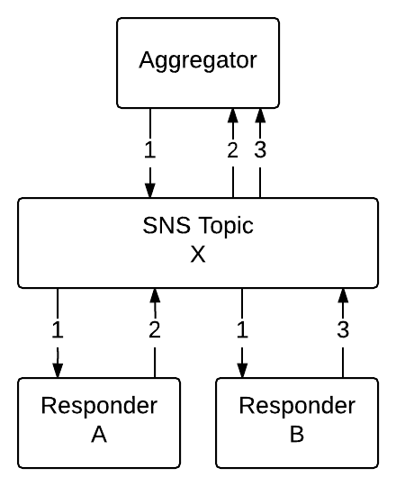
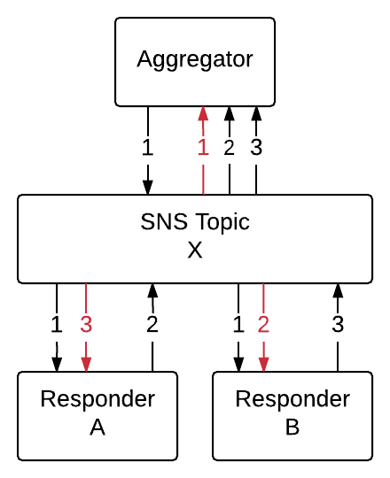

# aws-scatter-gather

An NPM package that facilitates the scatter gather design pattern using AWS SNS Topics.

[Tell me more!]('#about')

## Examples

### Aggregators

**Define an Aggregator**

For this example, the code resides in `aggregators.js`.

```js
const Scather = require('aws-scatter-gather');

// define an aggregator
exports.greetings = Scather.aggregator({
    composer: function(responses) {
        const str = Object.keys(responses)
            .map(function(language) {
                return language + ': ' + responses[language];
            })
            .join('\n\t');
        return 'Greetings in multiple languages: \n\t' + str;
    },
    expects: ['english'],
    maxWait: 2500,
    minWait: 0,
    responseArn: 'arn:aws:sns:us-west-2:064824991063:ResponseTopic',
    topicArn: 'arn:aws:sns:us-west-2:064824991063:RequestTopic'
});
```

**Unit Testing**

Check that your aggregator is running as expected.

```js
const aggregators = require('./aggregators');
const english = require('../lambdas/english/index').english;

// run mock aggregation - using a callback paradigm
aggregators.greetings.mock('James', [ english ], function(result) {
    console.log(result);
});

// run mock aggregation - using a promise paradigm
aggregators.greetings.mock('James', [ english ])
    .then(function(result) {
        console.log(result);
    });
```

**Integration**

Actually use SNS to communicate. You will need a server that is subscribed to the SNS Topic.

```js
const aggregators = require('./index.js');
const express = require('express');
const Scather = require('aws-scatter-gather');

// create an express app and add the scather sns middleware
const app = express();
app.use(Scather.middleware({
    endpoint: 'https://url-to-this-server.com',
    server: app,
    topics: ['arn:aws:sns:us-west-2:064824991063:ResponseTopic']
}));

// start the server listening on port 3000
app.listen(3000, function() {

    // aggregate results through the SNS Topics - using callback paradigm
    aggregators.greetings('James', function(err, data) {
        console.log(data);
    });

    // aggregate results through the SNS Topics - using promise paradigm
    aggregators.greetings('James')
        .then(function(data) {
            console.log(data);
        });
});
```

### Lambdas

**Define a Lambda**

For this example, the code resides in `lambda.js`.

Notice that there are examples for a callback paradigm and a promise paradigm. You only need one.

```js
const Scather = require('aws-scatter-gather');

exports.handler = Scather.lambda(exports.english);

// promise paradigm
exports.english = Scather.response(function(data) {
    return 'Hello, ' + data;
});

// callback paradigm
exports.english = Scather.response(function(data, callback) {
    callback(null, 'Hello, ' + data);
});
```

**Unit Testing**

```js
const lambda = require('./index');

// callback paradigm
lambda.response('James', function(err, data) {
    console.log(data);
});

// promise paradigm
lambda.response('James')
    .then(function(data) {
        console.log(data);
    });
```

## API

### aggregator ( configuration: Object ) : Function

Produce an aggregator function that can be called to make a request and aggregate responses.

*Parameters*

- *configuration* - This parameter defines how the aggregator should send out the response and how to gather results. Options for the configuration are as follows:
    - *composer* - An optional function that can be defined to process and/or transform the results gathered in from a scatter request.
    - *expects* - An array of strings for responses that are expected. If all expected responses have been received and the *minWait* has been reached then the aggregator will resolve immediately. Defaults to `[]`.
    - *maxWait* - The maximum number of milliseconds to wait for all expected responses before resolving the aggregator. Defaults to `2500`.
    - *minWait* - The minimum number of milliseconds to wait before resolving the aggregator. Defaults to `0`.
    - *name* - The aggregator function name. Defaults to `-`.
    - *responseArn* - The SNS Topic ARN that responders should send responses to. Defaults to match the *topicArn*.
    - *topicArn* - **REQUIRED** The SNS Topic ARN to send requests to. Responders will need to be listening on this Topic ARN.

*Returns* a function that can take one or two arguments. The first argument is the data to send with the request. The second parameter is an optional callback function. If the callback is omitted then a Promise will be returned.

### event

### lambda ( handler: Function )

If the lambda function is invoked by an SNS Topic then the handler will be called with the relevant data. Once the handler completes the lambda function will route the response back to the aggregator.

*Parameters*

- *handler* - A function that can be called with an AWS SNS Topic notification payload. If the notification is an [aggregator](#aggregator--configuration-object---function) request then the [response](#response--handler-function---function) handler will be called with just the relevant request data.

*Returns* a function that is intended to be invoked by an SNS Topic event.

### middleware ( configuration: Object ) : Function

*Parameters*

- *configuration* - This parameter defines how the middlware should operate. Options for the configuration are as follows:
    - *endpoint* - **REQUIRED** The URL for the running server that needs to subscribe to SNS Topics.
    - *passThrough* - A boolean indicating whether SNS Topic notifications should be passed to the server once processed. Defaults to `false`.
    - *server* - **REQUIRED** A reference to the server object that is incorperating this middleware.
    - *sns* - An AWS.SNS instance. Defaults to creating its own, but its own may not be configured property. You can configure it by setting SNS defaults or passing in your own AWS.SNS instance.
    - *subscribe* - A boolean indicating whether an SNS Topic subscription should automatically be made for any *topics* listed. There is no harm in attempting to resubscribe to a topic. Defaults to `true`.
    - *topics* - An array of Topic ARN strings that the middleware will handle requests for. Defaults to `[]`.

### response ( handler: Function ) : Function

Produce a response function.

*Parameters*

- *handler* - A function to call with request data. This function will be called with its defined signature (either using callbacks or promises). Note that when the handler is invoked, the invocation signature does not need to match the calling signature. The calling signature can use promises or callbacks, independent of the handler signature.

*Returns* a function that can take one or two arguments. The first arguments is the data to have the response process. The second parameter is an optional callback function. If the callback is omitted then a Promise will be returned.

**Example of Free Form Paradigm Execution**

```js
// define response using the promise paradigm
const resP = Scather.response(function(data) {
    return 'Hello, ' + data;
});

// define a response using the callback paradigm
const resC = Scather.response(function(data, callback) {
    callback(null, 'Hello, ' + data);
});

// call resP using promise paradigm
resP('James')
    .then(function(data) {
        console.log(data);
    });

// call resP using callback paradigm
resP('James', function(err, data) {
    console.log(data);
}

// call resC using promise paradigm
resC('James')
    .then(function(data) {
        console.log(data);
    });

// call resC using callback paradigm
resC('James', function(err, data) {
    console.log(data);
}
```


## About

A scatter-gather design pattern sends a single request to many servers and then aggregates the responses of those servers. Because this module uses AWS SNS Topics for communication it is using an asynchronous messaging pattern.

### What is an SNS Topic

An AWS SNS Topic is a messaging channel that any number of servers can subscribe to. When the SNS Topic receives an event it pushes that event to all servers that are subscribed to the topic.

### Synchronous vs Asynchronous Messaging

HTTP is commonly used to make synchronous requests:

1. A client initiates a connection with a server.
2. The client sends the request over that connection.
3. The server sends the response over that connection.
4. The connection is closed.

For asynchronous requests:

1. A client initiates a connection with a server.
2. The client sends the request over that connection.
3. The server confirms that the request was received.
4. The connection is closed.
5. At some point in the future:
    1. The server initiates a connection with the client*.
    2. The server sends the response to the client.
    3. The client confirms the response was received.
    4. The connection is closed.

\* *I am aware that the server is now the client and the client the server, but to keep things simple I kept their names the same.*



### Deciding on the Number of Topics

**Option 1**

The below image more accurately portrays messaging when using a single SNS Topic:



Using a single topic reduces initial set up, but it increases network traffic and the number of times requests are processed. The number of additional requests that would be made in this situation can be caluculated using this formula:

`N x N + 1`

`N` is the number of servers responding to the request.

So, if you have `5` servers that are responding to requests from the aggregator then you'll have a total of 26 additional requests that did not need to be made. Every requests will consume both consume the network bandwidth and processing time.

**Option 2**

An alternative is to use two SNS Topics:

1. Topic X can be subscribed to by all servers that are listing for requests. The client will make it's request to this topic.
2. Topic Y can be subscribed to by the client aggregating the responses. All servers will publish their responses to this topic.

Using this method no unneeded requests will be made.

